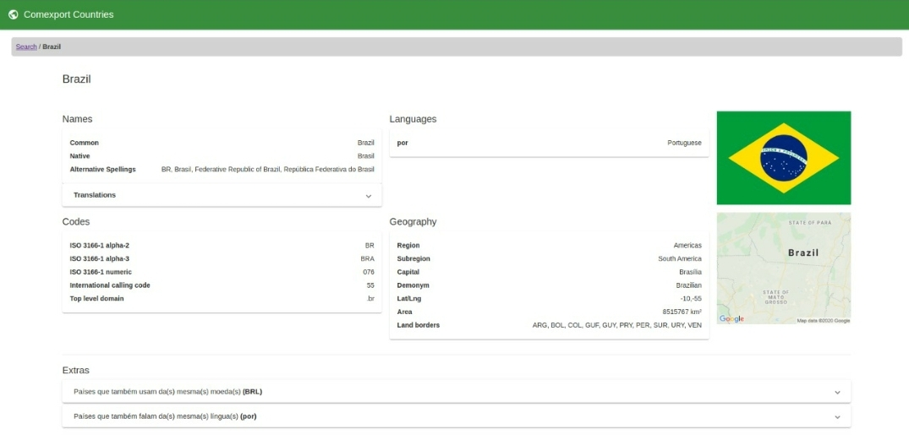
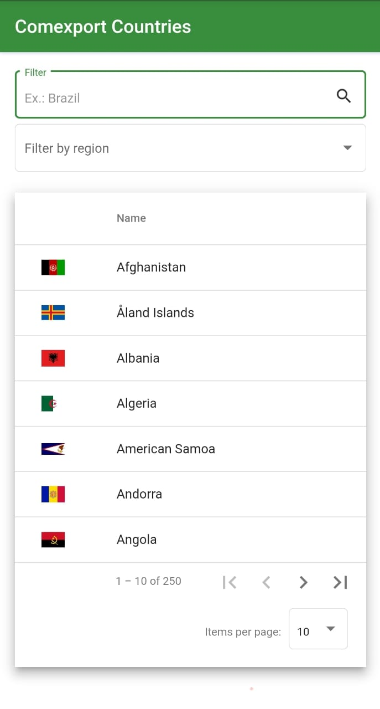
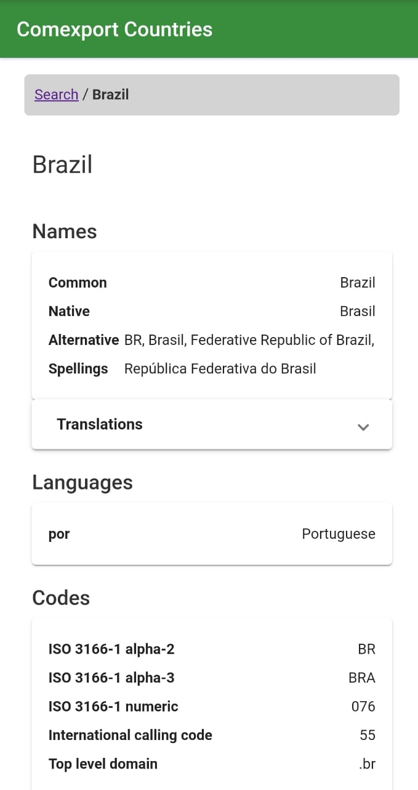
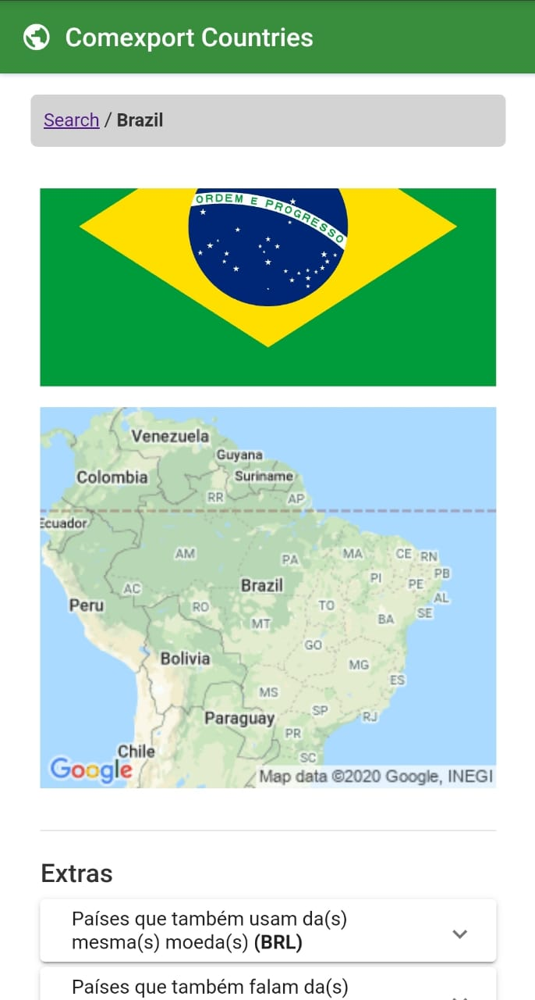

<h1>Comexport Countries</h1>

<h3 align="center">
    <b style="color: #569f59">Procure por qualquer páis!</b>  
    <br>
</h3>

<p align="center">
  <a href="https://nodejs.org/en/" target="_blank">
    
  </a>
  <a href="https://www.npmjs.com/" target="_blank">
    
  </a>
  <a href="https://www.linkedin.com/in/gustavodomingueti/" target="_blank">
    
  </a>
  <a target="_blank">
    
  </a>
</p>

<p align="center">
  <a href="#sobre">Sobre</a>&nbsp;&nbsp;&nbsp;|&nbsp;&nbsp;&nbsp;
  <a href="#tecnologias-utilizadas">Tecnologias</a>&nbsp;&nbsp;&nbsp;|&nbsp;&nbsp;&nbsp;
  <a href="#pre-requisitos">Pré-requisitos</a>&nbsp;&nbsp;&nbsp;|&nbsp;&nbsp;&nbsp;
  <a href="#como-usar">Como usar</a>&nbsp;&nbsp;&nbsp;|&nbsp;&nbsp;&nbsp;
  <a href="#como-contribuir">Como contribuir</a>&nbsp;&nbsp;&nbsp;|&nbsp;&nbsp;&nbsp;
  <a href="#license">Licença</a>
</p>

<a id="sobre"></a>

## :bookmark: Sobre

O <strong>ComexportCountries</strong> é uma aplicação Web e Mobile para ajudar pessoas a encontrarem países pelo mundo e visualizar suas características como nome, líguas, moedas, geografia, etc.

<a id="tecnologias-utilizadas"></a>

## :rocket: Tecnologias Utilizadas

O projeto foi desenvolvido utilizando as seguintes tecnologias

- [TypeScript](https://www.typescriptlang.org/)
- [Node.js](https://nodejs.org/en/)
- [Angular](https://angular.io/)
- [Rxjs](https://www.learnrxjs.io/)

## :heavy_check_mark: :computer: Resultado Web

<h1 align="center">
    
    
</h1>

## :heavy_check_mark: :iphone: Resultado Mobile

<h1 align="center" style="display: flex; align-items: start; justify-contente: center; width: 200px">
    
    
    
</h1>

<a id="como-usar"></a>

## :fire: Como usar

- ### **Pré-requisitos**

  - É **necessário** possuir o **[Node.js](https://nodejs.org/en/)** instalado na máquina
  - Também, é **preciso** ter um gerenciador de pacotes seja o **[NPM](https://www.npmjs.com/)** ou **[Yarn](https://yarnpkg.com/)**.

1. Faça um clone :

```sh
  $ git clone git@github.com:dominguetigs/comexport-countries.git
```

2. Executando a Aplicação:

```sh
  # Instale as dependências
  $ npm install

  # Inicie a aplicação
  $ npm run start:open

  # Se quiser rodar externamente num dispositivo móvel
  $ npm run start:host

  # Testes
  $ npm run test

  # Build
  $ npm run build
```

<a id="como-contribuir"></a>

## :recycle: Como contribuir

- Faça um Fork desse repositório,
- Crie uma branch com a sua feature: `git checkout -b my-feature`
- Commit suas mudanças: `git commit -m 'feat: My new feature'`
- Push a sua branch: `git push origin my-feature`

## :memo: License

Esse projeto está sob a licença MIT. Veja o arquivo [LICENSE](LICENSE.md) para mais detalhes.

---

<h4 align="center">
    Feito com 💙 by <a
      href="https://www.linkedin.com/in/gustavodomingueti/"
      target="_blank"
    >Gustavo Domingueti</a>
</h4>
